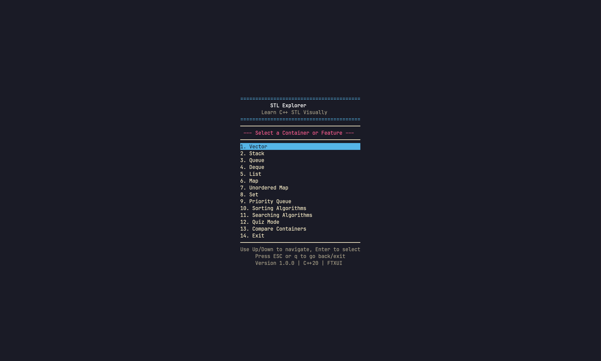
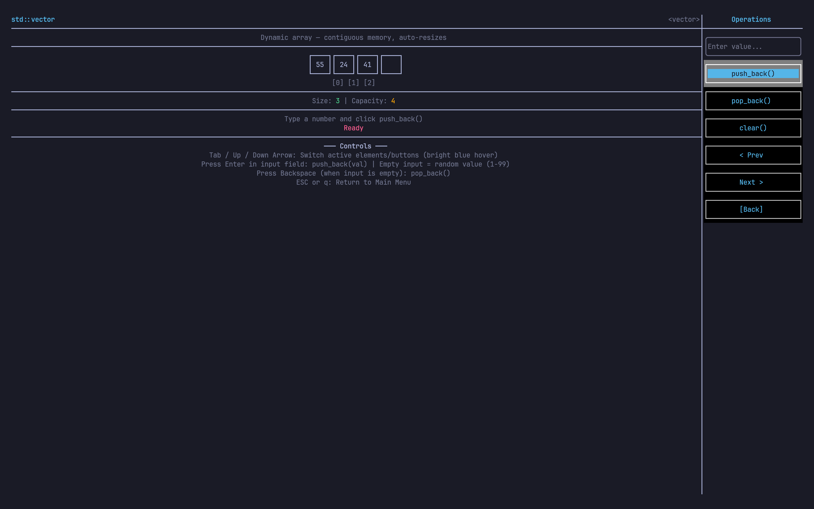
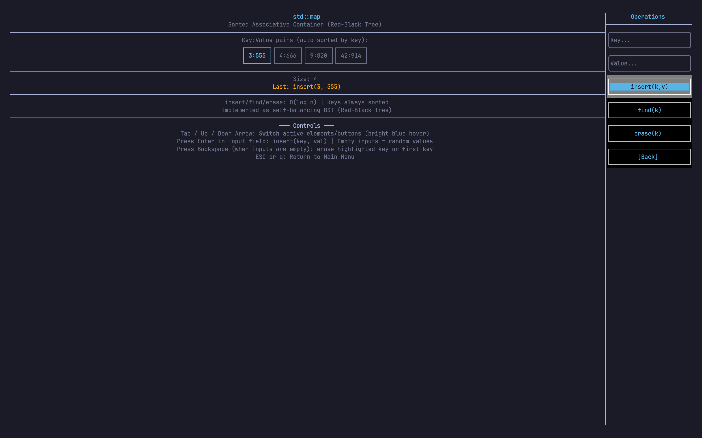
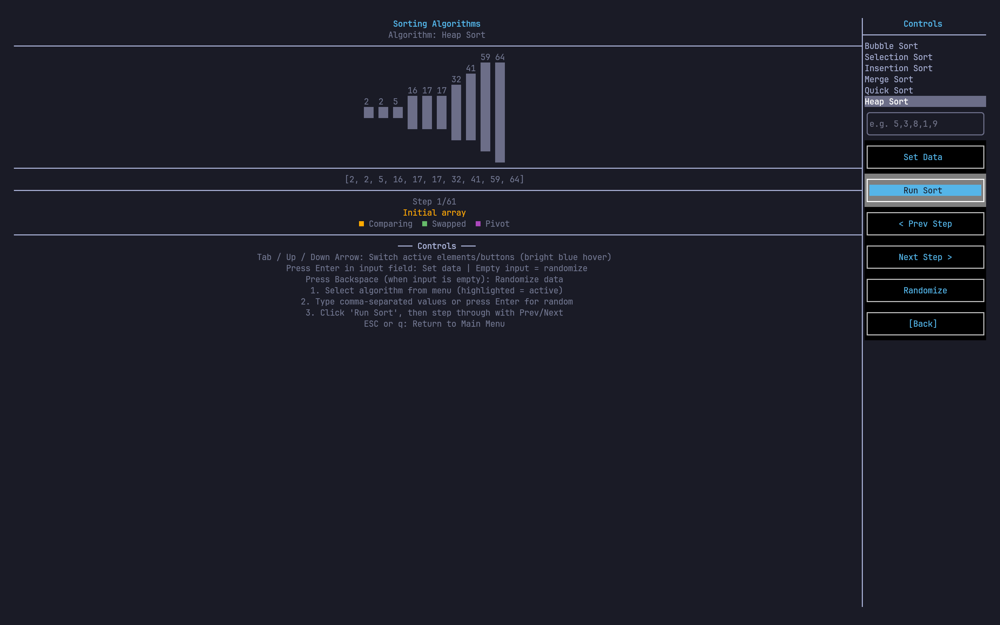
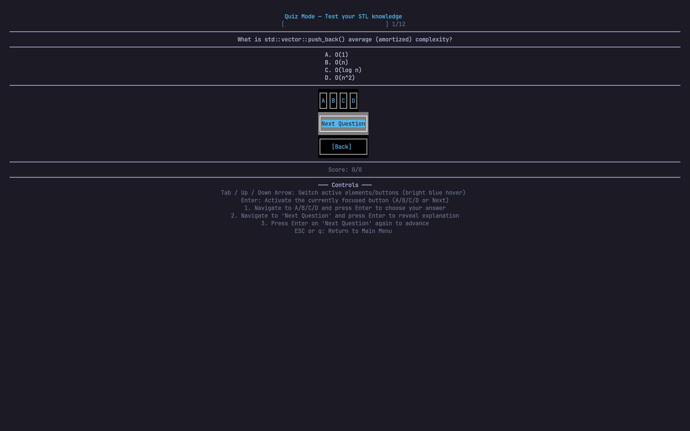
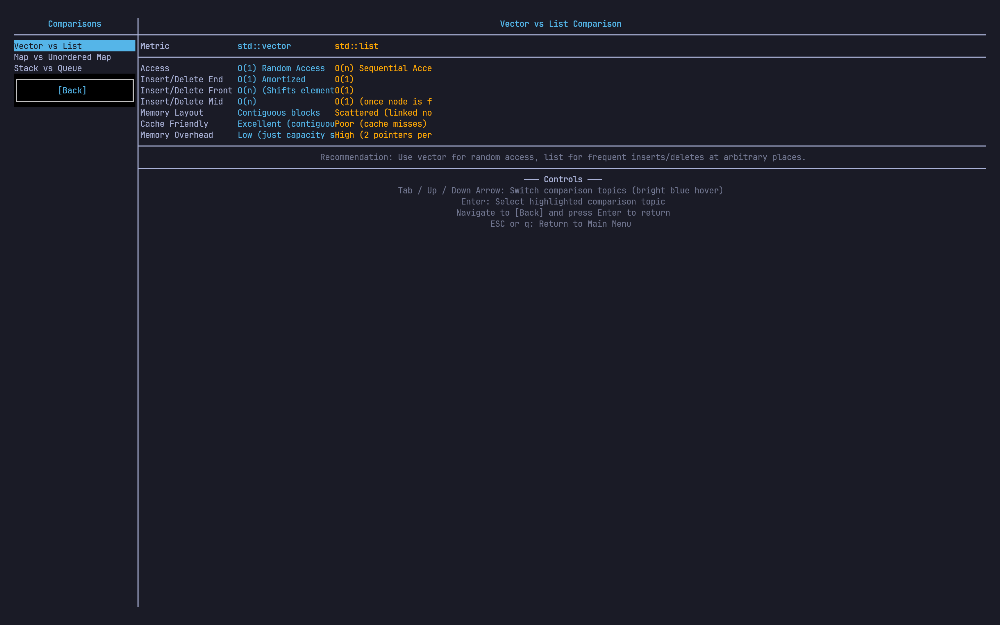

# STL Explorer

STL Explorer is an interactive terminal application designed to help developers visualize, learn, and experiment with the C++ Standard Template Library (STL). Through real-time terminal animations, detailed complexity analysis, and hands-on container manipulation, the application makes abstract C++ concepts concrete and accessible.

This project is open source, and we welcome contributions from the developer community.

---

## Screenshots

Here are some screenshots of the application running inside the terminal:

### Main Menu


### Vector Visualization with Operations Sidebar


### Map Visualization with Active Operations


### Sorting Algorithms Visualizer


### Interactive Quiz Mode


### Dynamic Container Comparison


---

## Features

### Interactive Container Visualization
Every container visualizes its memory layout, elements, and metadata in real-time.
* **Vector**: Contiguous memory layout showing dynamic resizing, capacity doubling, and reallocations.
* **Stack**: Last-In-First-Out (LIFO) visualization showing element insertion (push) and deletion (pop) at the top.
* **Queue**: First-In-First-Out (FIFO) visualization showing enqueue and dequeue operations with front and back indicators.
* **Deque**: Double-ended queue layout showing push/pop operations from both the front and back.
* **List**: Doubly Linked List representation showing pointer linkages (`NULL <-> [Node] <-> NULL`).
* **Map**: Sorted associative container showing key-value pairs stored in a self-balancing binary search tree.
* **Unordered Map**: Hash table visualization showing bucket indices, hashing, and collision chaining.
* **Set**: Sorted unique elements container.
* **Priority Queue**: Binary max-heap visualization displaying elements level-by-level using structured indentation.

### Step-by-Step Algorithms
Explore how sorting and searching algorithms work step-by-step with state highlights.
* **Sorting**: Real step-by-step animations for Bubble Sort, Selection Sort, Insertion Sort, Merge Sort, Quick Sort, and Heap Sort. Tracks pivots, comparisons, and swaps.
* **Searching**: Comparative visualizer for Linear Search and Binary Search showing index bounds and partitioning.

### Interactive Sandbox with Split Layout
* **Custom Initialization**: When entering any container or algorithm module, you are prompted to initialize it with custom comma-separated values or proceed with a default random set.
* **Split Layout**: The UI splits into a visualization pane on the left and an Operations sidebar on the right.
* **Focus Indicators**: Active input boxes and buttons highlight clearly when navigated, with focused inputs bordered in bold bright blue for clear accessibility.

### Educational Tools
* **Side-by-Side Comparisons**: Choose between Vector vs List, Map vs Unordered Map, and Stack vs Queue to view performance characteristics, iterator support, and recommendations.
* **Interactive Quiz**: Test your knowledge with 12 distinct STL questions covering time complexities, memory models, and data structure characteristics.

---

## Keyboard Controls

| Key | Context | Action |
| --- | --- | --- |
| `Up / Down Arrow` | General | Navigate vertical menus or elements |
| `Left / Right Arrow` | General | Navigate horizontal choices or buttons |
| `Tab` | General | Cycle focus through active buttons and inputs |
| `Enter` | General | Select the active option or submit inputs |
| `Backspace` | Inside Modules | Triggers a pop/remove/randomize action when the input field is empty |
| `Escape` / `q` | General | Go back to the previous screen or exit the application |

---

## Build Instructions

### Prerequisites
* **Compiler**: GCC 10+ or Clang 12+ (Full C++20 support required)
* **Build System**: CMake 3.20 or higher
* **Operating System**: Linux or macOS

### Step-by-Step Build
1. Create a build directory:
   ```bash
   mkdir build && cd build
   ```

2. Generate build files:
   ```bash
   cmake ..
   ```

3. Build the project:
   ```bash
   make -j$(nproc)
   ```

4. Run the application:
   ```bash
   ./stl_explorer
   ```

### Dependencies
This project uses the FTXUI library for rendering the terminal user interface. FTXUI is automatically fetched and configured via CMake FetchContent during step 2. No manual installation is necessary.

---

## Project Structure

```
STL-Explorer/
├── include/                     # Header files grouped by module
│   ├── containers/              # Container declarations
│   ├── algorithms/              # Sort and search declarations
│   ├── core/                    # Core layout and rendering components
│   └── utils/                   # Shared theme and parser utilities
├── src/                         # Source files
│   ├── containers/              # Container state and visualization implementations
│   ├── algorithms/              # Algorithm step generation implementations
│   ├── core/                    # Quiz and Comparison logic
│   └── utils/                   # Theme settings and utility implementations
├── CMakeLists.txt               # Build configuration
├── .gitignore                   # Version control exclusions
└── README.md                    # Project documentation
```

---

## Design Principles
* **Separation of Concerns**: State representation, animations, and rendering logic are decoupled.
* **Modern C++**: Heavy use of C++20 features (concepts, smart pointers, standard library utilities) to ensure clean memory safety.
* **Extensibility**: The modular architecture allows developers to easily add new containers or search/sort algorithms.

---

## Contributing

We welcome contributions to make STL Explorer more educational and robust. To contribute:

1. Fork the repository on GitHub.
2. Create a new branch named after your feature (e.g., `git checkout -b feature/your-feature-name`).
3. Write clean, readable code following modern C++20 guidelines.
4. Document any new features or visual components in your code.
5. Commit your changes with descriptive commit messages.
6. Push to your branch and open a Pull Request.

Please ensure the project builds successfully on your local system before submitting a Pull Request.

---

## License

This project is licensed under the MIT License. See the `LICENSE` file for more details.
